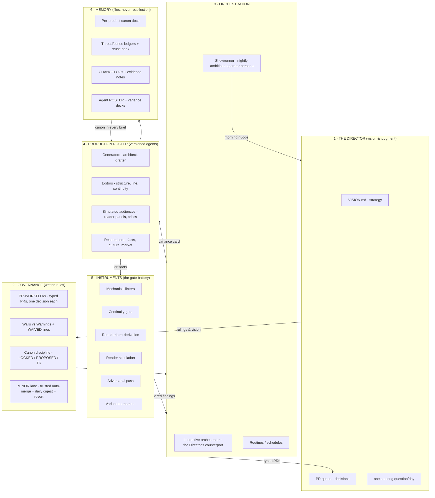

# The Studio Architecture

_How this agentic studio works: every layer, every instrument, every
agent, and how they relate — written so the pattern can be lifted
whole and applied to any other domain (a website, a product, a
newsletter, a codebase). The book studio is one instantiation; the
architecture is the product._

---

## The one-paragraph version

A single human (**the Director**) supplies vision and judgment.
Everything else — production, review, verification, scheduling,
even most small decisions — is done by a roster of versioned agents
operating under written governance. The Director steers through
three narrow interfaces: a one-page **vision doc**, a queue of
**typed pull requests** (each one decision), and **one steering
question per day**. Work descends a ladder of small, verified
representations before it becomes expensive; every rung is checked
by a battery of cheap instruments; every decision is recorded in
canon documents, never in memory. Momentum comes from a nightly
**operator persona** whose mandate is that nothing idles.

## The layer diagram

## Layer 1 — The Director

One human. Three levers, all asynchronous:

| Lever | Cadence | What it steers |
|---|---|---|
| `VISION.md` | edit anytime | Strategy — the nightly operator re-reads it before acting; one changed sentence reorients the studio by morning |
| The PR queue | merge / comment | Tactics — every decision is a typed PR with the recommended option already applied; merge = approve = recorded; a comment = a ruling that gets applied |
| The steering question | ≤1 per day | Genuine forks the vision doc doesn't answer |

Two safety instruments belong to the Director alone: **revert #N**
(undo any trusted auto-merge, same day) and **"hold minors"** (a
kill switch on the trust lane).

## Layer 2 — Governance (the rules are files)

- **If it's the Director's action, it's a PR** — never a chat
  message or a mental note. The open queue IS the to-do list.
  Corollary: a decision parked in a note is *queue debt*; someone
  owes its extraction into a PR.
- **One PR = one decision**, typed `[product][TYPE]`, body quotes
  the actual artifact lines (not just rule text), recommended option
  applied in the diff. Budget: 5–7 in flight, ever.
- **Walls vs warnings.** A small set of inviolables (canon, audience
  band, fair play, the Director's voice) are walls — no agent may
  schedule work that bends one. Everything else is a warning tier:
  flag, propose a patch, never block. Exceptions are explicit,
  greppable `WAIVED:` lines with a reason and a date.
- **Canon discipline.** Decisions get recorded, not remembered:
  LOCKED vs PROPOSED status on every ruling; unknown facts are
  `[TK]`, unverified facts `[CHECK:]` — both greppable; nothing gets
  silently invented or silently decided.
- **The MINOR lane** (the trust dial): PRs typed MINOR at creation
  may be auto-merged by the nightly shift after independent
  re-verification, reported in a daily digest with a one-word revert
  path; any doubt disqualifies; one revert suspends the lane a day.

## Layer 3 — Orchestration

- **The interactive orchestrator** (the Director's live
  counterpart): routes work to specialists, applies rulings
  immediately, keeps branches/PRs/artifacts in order, never merges
  non-MINOR PRs.
- **The Showrunner** (the momentum engine): a nightly persona — a
  young, ambitious, well-intentioned operator — who re-reads the
  vision, computes every product's true state *from files* (stored
  status boards rot; one stale "Complete" was the most expensive
  inaccuracy in the repo), writes a "path to market" paragraph and a
  "weakest craft point" line per product, dispatches up to 3
  instrument runs and up to 2 PRs, works the MINOR lane, and leaves
  a morning nudge: WHAT MOVED / MERGED FOR YOU / WHAT AWAITS /
  THE ONE THING / ≤1 steering question.
- **Routines**: cron-fired sessions carry the night shift; one-shot
  check-ins babysit open gates.

## Layer 4 — The production roster

Generic roles (the book studio's names in parentheses):

| Role | Studio instance | Notes |
|---|---|---|
| Structure generator | plot-architect | premise → verified plan |
| Producer | drafting-assistant | plan → first-draft artifact; only from APPROVED plans + a voice/style sample |
| Structural editor | developmental-editor | big-picture critique |
| Surface editor | line-copy-editor | mechanical fixes applied, style proposed |
| Consistency editor | continuity-keeper | facts vs canon; runs LAST, always separate from the other two |
| Simulated audience | kid-reader-panel | the target user's actual reaction, pre-launch |
| Adversary | red-team-critic | the harshest fair read |
| Outside reviewer | junior-literary-critic | critique + prioritized recommendations |
| Domain researcher | culture-researcher | facts, respect, accuracy; web access |
| Market roles | market-pitch-agent, gtm-strategist | selling and channel economics |
| Program manager | showrunner | see Layer 3 |

Roster mechanics that make agents a *team* rather than prompts:

- **Versioned like software**: semver in a ROSTER; every change is a
  CHANGELOG entry citing the production evidence that forced it; a
  BACKLOG holds known weaknesses.
- **The variance system**: every run draws one card (least recently
  used) from its deck — a lens shift ("antagonist-first",
  "start from the weakest chapter") that keeps repeated runs from
  calcifying, while a **banned-moves ledger** blocks each agent's
  recently-overused devices. Cards shift emphasis, never standards.
- **Personas**: cheap parameterizations that specialize a generic
  agent to one product without forking it.

## Layer 5 — The instruments (the gate battery)

The core theory: **the cost of an error grows with the size of the
artifact it's embedded in** — so work descends a ladder of
representations (one sentence → paragraph → quarters → per-unit
summaries → briefs → full artifact), and each rung is gated before
the next expansion. Rung contract: `expand → gate battery → Director
ratifies → FREEZE`; later holes are fixed at the rung that
introduced them and re-derived downward.

The battery, cheapest first:

1. **Mechanical linters** — anything greppable gets grepped, never
   proofread (names, timeline words, banned punctuation patterns,
   budget counters). Machines don't tire; style tics self-copy
   through imitation, linters don't.
2. **Consistency gate** — full canon review with numbered findings,
   each classified (CONTRADICTION / UNESTABLISHED /
   DECIDES-OPEN-QUESTION / DELIBERATE-CHECK) and severity-tiered
   (in-artifact = blocking; cross-artifact = warning).
3. **Round-trip re-derivation** — a deliberately *blind* agent
   reconstructs the upstream design from the downstream artifact
   alone; the diff against the real upstream is drift no forward
   reader can see. Archaeology mode: run it on legacy material to
   learn "what does the old artifact think it is?"
4. **Reader simulation** — the audience's reaction measured on the
   cheap representation, before the expensive one exists.
5. **Adversarial pass** — break the logic and the stakes before the
   Director ratifies.
6. **Variant tournament** — on OPEN decisions only: incumbents must
   beat fresh challengers, scored against the product's few
   winning concepts; the winner absorbs the runners-up's best single
   ideas. This is how old material gets creative pressure without
   anyone touching canon.

Supporting disciplines: **state chains** (every unit declares
STATE IN/OUT — day, who-knows-what, object locations — and N's OUT
must equal N+1's IN); **fact manifests** (a producer may only use
facts its brief enumerates; everything else is `[TK]`); **blind
drafting** (producers never see neighboring units — kills tic
propagation; a seam pass stitches transitions); **simulate, don't
prosify** (anything that is really data lives as a checkable table
the prose refers to).

## Layer 6 — Memory

Every product keeps: a **canon doc** (single source of truth, with
the locked-decisions log), a **thread ledger** (what each unit
plants, pays, and owes — updated only on *acceptance*), a
**CHANGELOG** (every edit and why), and **evidence notes** (every
instrument report). The studio keeps: the reuse bank (good material
that didn't fit — deposited, never lost), the agent roster files,
and the governance docs. The prime directive: **compute state from
files; store nothing in memory or status boards.**

## The feedback loops (what makes it improve)

1. Production failure → evidence → agent version bump (never edit an
   agent without citing the run that proved the gap).
2. Critique catches a repeated device → banned-moves ledger → next
   run can't use it.
3. Director revert → MINOR lane self-suspends → trust recalibrates.
4. Every Director chat ruling → recorded as canon or rule → the
   system never re-asks.

## Porting guide — e.g., "running a website"

The architecture is domain-blind. To port it:

| Studio concept | Website instance |
|---|---|
| Book / manuscript | The site: pages, posts, flows |
| Canon docs / bible | Brand guide, design system, content standards, IA map |
| Snowflake ladder | Brief → outline → wireframe/section map → page copy |
| Continuity gate | Brand/terminology/link/consistency audit vs the design system |
| Round-trip re-derivation | Reverse-engineer the spec from the live page; diff vs the real spec = drift |
| Reader simulation | Persona walkthroughs before build (does the buyer find pricing?) |
| Variant tournament | Headline/layout variants scored against conversion concepts; incumbents must win |
| Mechanical linters | Lighthouse, broken links, tone-word bans, SEO checks |
| State chains | Funnel-state map: what the visitor knows/holds at each step |
| THREADS ledger | Content calendar debts: every teaser pays off, every CTA lands somewhere |
| Density dial | Content depth tiers (pillar page vs. quick answer) declared, not accidental |
| Showrunner | Nightly growth operator: analytics scan → publisher's paragraph → dispatch audits → PRs for real decisions |
| MINOR lane | Auto-merge alt-text fixes, typo patches, meta tweaks; daily digest; revert |
| Walls | Brand voice, accessibility, legal/privacy — never auto-bent |

Porting checklist: (1) write the canon docs and the 3–4 winning
concepts; (2) declare the walls; (3) adopt the PR taxonomy and rule
6/7 verbatim; (4) define the ladder's rungs for the domain; (5) name
the roster and give every agent a version; (6) stand up the nightly
operator with the same budgets; (7) write VISION.md and hand the
Director their three levers.

---

_Proven in production on three books, 15 merged PRs, four instrument
types, and one nightly operator — see `studio/STUDIO-BLUEPRINT.md`
for the anonymized export and `studio/DRAFTING-PROTOCOL.md`,
`studio/PR-WORKFLOW.md` for the load-bearing rules in full._
